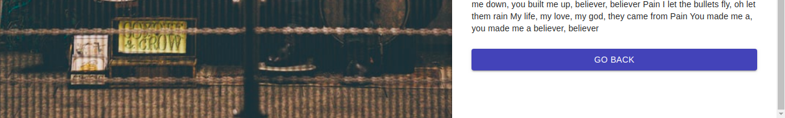

### About :notes: :

A simple but efficient app that gets you your favorite song lyrics

---

### Setup :flags: : 

- go to the repository _lyrics_ by typing ``` cd lyrics ```
- type ``` npm install ``` to install the required packages and dependencies.
- type ``` npm start ``` to run the app on the port 9000 set in the _.env_ file

---

### Screen-shots :movie_camera: : 

- it asks you to type your singer and the name of the song : 


---

- after confirming by clicking _FIND IT_ button here's the lyrics : 



